     

# Publications

- [Hornet 40: network dataset of geographically placed honeypots](https://www.sciencedirect.com/science/article/pii/S2352340922000075).  Data in Brief, 107795. Valeros, V., & Garcia, S. (2022). 
- [Growth and commoditization of remote access trojans](https://ieeexplore.ieee.org/abstract/document/9229824).  In 2020 IEEE European Symposium on Security and Privacy Workshops (EuroS&PW) (pp. 454-462). IEEE. Valeros, V., & Garcia, S. (2020, September). 
- [Machete: Dissecting the Operations of a Cyber Espionage Group in Latin America](https://ieeexplore.ieee.org/abstract/document/8802467).  In 2019 IEEE European Symposium on Security and Privacy Workshops (EuroS&PW) (pp. 464-473). IEEE. Valeros, V., Rigaki, M., & Garcia, S. (2019, June). 
- [Make it count: an analysis of a brute-forcing botnet](https://journal.cecyf.fr/ojs/index.php/cybin/article/view/5).  The Journal on Cybercrime & Digital Investigations, 1(1). Valeros, V. (2016). 

# Advising

- Master Thesis Supervisor Specialist, 2019-2020, [The first comprehensive report on the state of the security of mobile phones of civil society. Jakub Čech](https://dspace.cvut.cz/handle/10467/87847). FEE, CTU in Prague, Czech Republic 

# Teaching

- Fall 2021, Teaching assistant, Introduction to Computer Security (in English), Open Informatics Master Program, CTU in Prague
- Fall 2020, Teaching assistant, Introduction to Computer Security (in English), Open Informatics Master Program, CTU in Prague

# Trainings

- 2021 BlackHat Europe, trainer, Advanced Malware Traffic Analysis: Smarter Protection - 2021 Edition
- 2021 BlackHat USA, trainer, Advanced Malware Traffic Analysis: Smarter Protection - 2021 Edition
- 2021 NorthSec, trainer, Getting Your Hands Dirty: Understanding & Hunting Down Malware Attacks in Your Network
- 2020 BlackHat Europe, trainer, Advanced Malware Traffic Analysis - Adversarial Thinking - 2020 Edition
- 2020 BlackHat USA, trainer, Advanced Malware Traffic Analysis - Adversarial Thinking - 2020 Edition
- 2020 BlackHat Asia, trainer, Advanced Malware Traffic Analysis - Adversarial Thinking - 2020 Edition
- 2019 Ekoparty, trainer, Getting Your Hands Dirty: Understanding & Hunting Down Malware Attacks in Your Network
- 2019 BlackHat USA, trainer, Advanced Malware Traffic Analysis - Adversarial Thinking
- 2019 OWASP Czech Republic, trainer, Getting Your Hands Dirty: IoT Botnet Analysis
- 2019 BlackHat Asia, trainer, Advanced Malware Traffic Analysis - Adversarial Thinking
- 2019 Troopers, trainer, Machine Learning for Network Security and Malware Detection
- 2018 BlackHat Europe, trainer, Advanced Malware Traffic Analysis - Adversarial Thinking
- 2018 HackLu, trainer, Getting Your Hands Dirty: How to Analyze the Behavior of Malware Traffic and Web Connections
- 2018 Ekoparty, trainer, Advanced Malware Attacks In Your Network
- 2016 Botconf, trainer, Getting your hands dirty: How to Analyze the Behavior of Malware Traffic and Web Connections

# Contributions

- [Civilsphere AI VPN](https://github.com/stratosphereips/AIVPN), Core researcher and developer, 2021, AIC, FEL, CTU in Prague, Czech Republic 

# Initiatives

- Co-founder of the Independent Fund for Women in Tech, a global initiative to foster the participation of women in cybersecurity conferences, in 2018.
- Co-founder of the MatesLab hackerspace in Mar del Plata, Argentina, in 2009.
